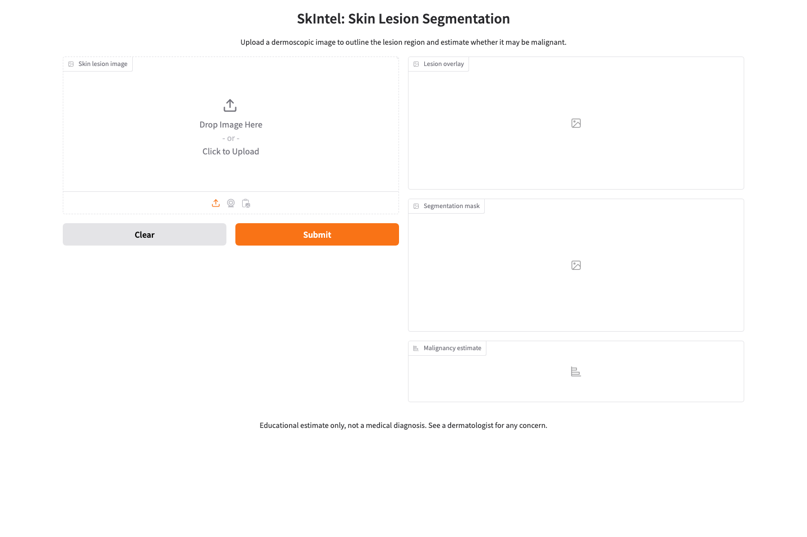

# SkIntel

Upload a dermoscopic skin lesion image to get a segmentation mask and a benign/malignant estimate.



## Models

A U-Net outlines the lesion; a small CNN classifies it. Both are bundled as ONNX models and run on CPU through ONNX Runtime, so serving the app does not require TensorFlow. Gradio supplies the upload interface.

The classifier was trained on a 967-image HAM10000 subset. Preprocessing converts uploaded RGB images to BGR to match the training data, then resizes and normalizes each model's input. Colab training and export scripts are included.

## Run locally

Requires Python 3.11 or 3.12. From this directory:

```bash
python -m venv .venv
source .venv/bin/activate
pip install -r requirements.txt
python app.py
```

Open http://localhost:7860. No API keys or model downloads are needed.

## Tests and timing

```bash
pip install -r requirements-dev.txt
python -m pytest
python benchmark.py --output benchmark-results.json
```

Tests check channel order, input shapes, and outputs from the bundled models. Dataset-dependent tests also run when `SKINTEL_DATA_DIR` points to a folder containing `X.npy` and `y.npy`.

[CPU benchmark details](docs/benchmark.json) record preprocessing, segmentation, overlay, and classification time on a synthetic image. Model loading and browser latency are excluded; this measures runtime, not predictive accuracy.

## Evaluation limits

The classifier training script uses an 80/20 image split and reports metrics on the same split used for validation. The repo does not include lesion identifiers to check for overlap between splits or an independent test-set report. The output is an educational estimate, not a medical diagnosis.
